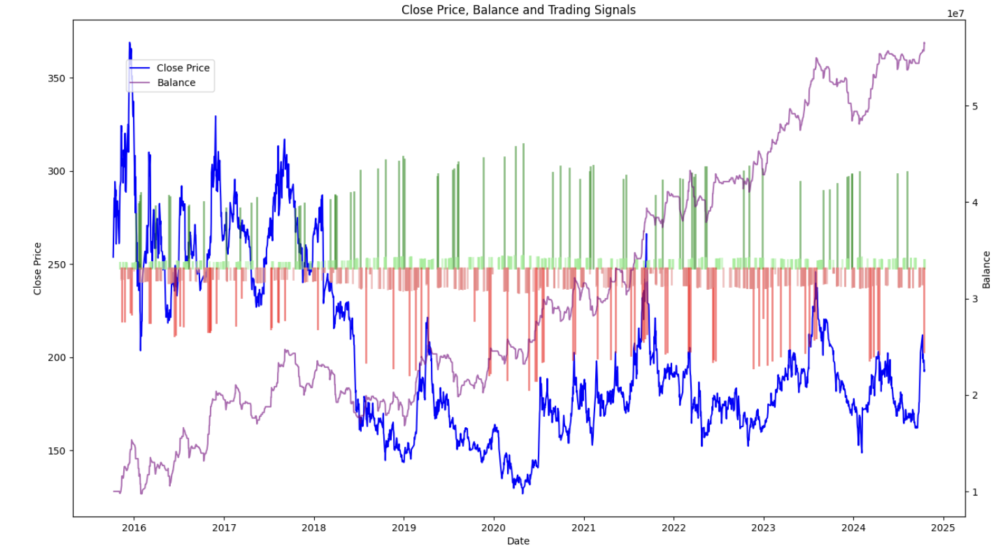
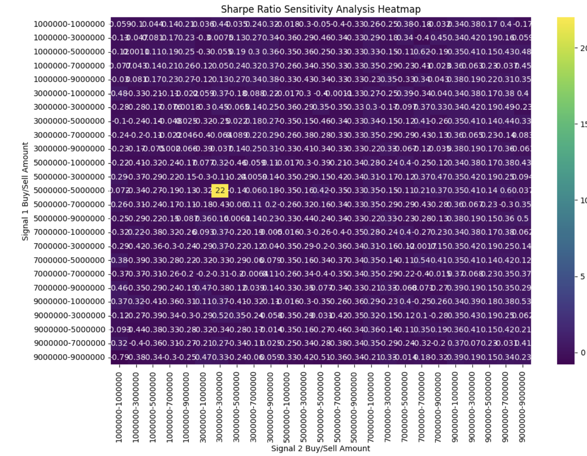

# Low-Frequency-RSI-Trading

### Goal:
The goal of this project is to build a backtesting framework to test the performance of alpha factors on individual stocks. I use Relative Strength Index (RSI) as the indicator, focusing on its ability to generate trading signals and assess stock performance. The framework will evaluate how RSI-based signals impact returns and risk in stock trading.

### Definition:

RSI, developed by Welles Wilder, is a popular momentum indicator that scales values from 0 to 100 to identify overbought and oversold conditions.

$$
RSI = 100 - \frac{100}{1+RS} = 100 \cdot \frac{RS}{1+RS}
$$

where:

$$
RS = \frac{AU}{AD}
$$

- **AU**: The sum of price increases over the past 14 days.
- **AD**: The sum of price decreases (used as positive values) over the past 14 days.

Once the initial calculation is completed, the **AU** and **AD** values can be updated daily using the average method (where \( p \) is the closing price):

$$
AU_t = AU_{t-1} + \frac{AU_{t-1}}{14} + \max(p_t - p_{t-1}, 0)
$$

$$
AD_t = AD_{t-1} + \frac{AD_{t-1}}{14} + \max(p_{t-1} - p_t, 0)
$$

### Structure

- Optimization: Optimizer for parameters by performing grid search on asset allocation

- RSI_calculator: RSI calculation and signal generation, including Overbought and Oversold Strategy and Countertrend  Strategy

- backtest: a comprehensive strategy to simulate trading with asset allocation and specific trading rules

- data: data preprocessing (please use your own data)

- visualization: graphing tool for signal, pnl, and heatmap

(Detailed Introduction is provided in folder's README)

### Example Workflow
 
1. Process data: columns = [CLOCK, SYMBOL, CLOSE]

2. RSI calculation and signal generation

3. Simulate trading, position, and pnl

4. sensitivity analysis to optimize parameter

